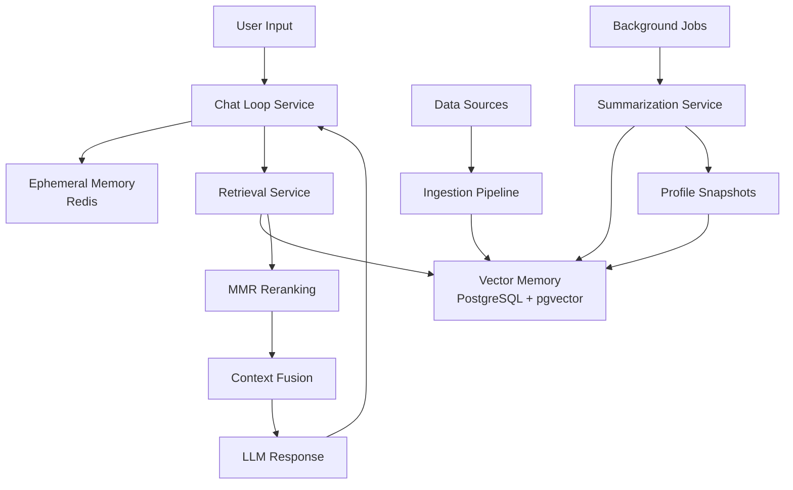

# PulsePlan Memory System Documentation

## Overview

The PulsePlan memory system is a comprehensive dual-layer memory architecture that combines **ephemeral chat memory** (Redis) with **persistent semantic memory** (PostgreSQL + pgvector). This system enables intelligent context retrieval, behavior analysis, and personalized academic planning.

## Architecture



### Core Components

1. **Ephemeral Chat Memory (Redis)**
   - Stores recent chat turns per session
   - TTL-based automatic cleanup
   - Fast access for conversation context

2. **Persistent Semantic Memory (PostgreSQL + pgvector)**
   - Long-term storage with semantic search
   - Multiple namespaces for different content types
   - Vector embeddings for similarity search

3. **Retrieval Fusion**
   - Combines recent chat + relevant memories
   - MMR reranking for diversity
   - Token budget management

## Database Schema

### pgvector Schema (`memory_schema.sql`)

```sql
-- Main memory table
CREATE TABLE vec_memory (
  id uuid PRIMARY KEY DEFAULT gen_random_uuid(),
  user_id uuid NOT NULL,
  namespace text NOT NULL,              -- Content category
  doc_id text NOT NULL,                 -- External reference ID
  chunk_id int DEFAULT 0,               -- For chunked documents
  content text,                         -- Raw content
  summary text,                         -- Brief summary (primary for embeddings)
  embedding vector(1536) NOT NULL,      -- OpenAI embedding
  metadata jsonb DEFAULT '{}'::jsonb,   -- Flexible metadata
  created_at timestamptz DEFAULT now(),
  updated_at timestamptz DEFAULT now()
);

-- Performance indexes
CREATE INDEX vec_mem_ivf ON vec_memory 
  USING ivfflat (embedding vector_cosine_ops) WITH (lists = 100);
CREATE INDEX vec_mem_user_ns ON vec_memory (user_id, namespace);
CREATE INDEX vec_mem_due ON vec_memory 
  ( ((metadata->>'due_at')::timestamptz) ) WHERE namespace='task';
```

### Redis Schema

```
Key Pattern: chat:ctx:{userId}:{sessionId}
Value: List of JSON chat turns
TTL: 12 hours
Max Items: 48 turns
```

## Memory Namespaces

| Namespace | Purpose | Example Content |
|-----------|---------|----------------|
| `task` | Actionable items | Assignments, study blocks, project steps |
| `doc` | Reference materials | PDFs, syllabi, study guides |
| `email` | Communication threads | Instructor emails, action items |
| `calendar` | Time constraints | Events, deadlines, availability |
| `course` | Academic structure | Policies, grading, exam windows |
| `chat_summary` | Conversation history | Daily chat summaries |
| `profile_snapshot` | Behavioral patterns | Weekly activity analysis |
| `web` | External references | Clipped pages, rubrics |

## Service Architecture

### 1. Chat Memory Service (`chat_memory.py`)

Manages ephemeral conversation context in Redis.

```python
from app.memory import get_chat_memory_service

service = get_chat_memory_service()

# Store chat turn
await service.push_chat_turn(
    user_id="123", 
    session_id="session-456",
    turn=ChatTurn(role="user", text="Help me schedule my assignments")
)

# Retrieve recent turns
turns = await service.get_recent_turns(user_id="123", session_id="session-456")
```

**Key Features:**
- Automatic TTL management (12 hours)
- Capped list size (48 turns)
- Chronological ordering
- Session statistics

### 2. Vector Memory Service (`vector_memory.py`)

Manages persistent semantic storage and search.

```python
from app.memory import get_vector_memory_service
from app.memory.types import VecMemoryCreate, SearchOptions

service = get_vector_memory_service()

# Store memory
memory = VecMemoryCreate(
    user_id="123",
    namespace="task",
    doc_id="canvas:assignment-789",
    summary="CS101 Project 1: Build web app, due March 15",
    metadata={
        "course": "CS101",
        "due_at": "2024-03-15T23:59:00Z",
        "priority": 3
    }
)
memory_id = await service.upsert_memory(memory)

# Search memory
search = SearchOptions(
    user_id="123",
    namespaces=["task", "course"],
    query="CS101 assignments due this week"
)
results = await service.search_memory(search)
```

**Key Features:**
- Semantic similarity search
- Namespace filtering
- Date range filtering
- Urgency scoring
- Automatic embedding generation

### 3. Retrieval Service (`retrieval.py`)

Combines chat context with semantic memory using MMR reranking.

```python
from app.memory import get_retrieval_service

service = get_retrieval_service()

# Build comprehensive context
context = await service.build_chat_context(
    user_id="123",
    session_id="session-456", 
    user_message="What should I work on today?",
    token_budget=2000
)
```

**MMR Algorithm:**
- Balances relevance and diversity
- Lambda parameter controls trade-off (0.65 default)
- Prevents redundant context items
- Respects token budgets

### 4. Ingestion Service (`ingestion.py`)

Converts various data sources into memory entries.

```python
from app.memory import get_ingestion_service
from app.memory.types import Assignment

service = get_ingestion_service()

# Ingest Canvas assignment
assignment = Assignment(
    id="789",
    title="Web Development Project",
    description="Build a full-stack web application...",
    course="CS101", 
    due_at="2024-03-15T23:59:00Z",
    effort_min=480  # 8 hours
)

memory_id = await service.ingest_assignment(user_id="123", assignment=assignment)
```

**Supported Data Types:**
- Canvas assignments
- Calendar events  
- Email threads
- Documents (with chunking)
- User preferences
- Weekly behavioral snapshots

### 5. Summarization Service (`summarization.py`)

Persists chat sessions as searchable summaries.

```python
from app.memory import get_summarization_service

service = get_summarization_service()

# Summarize completed session
memory_id = await service.summarize_and_persist_session(
    user_id="123",
    session_id="session-456"
)
```

**Features:**
- Automatic summarization triggers
- Configurable turn thresholds
- Topic extraction
- Metadata enrichment

### 6. Weekly Profile Service (`profile_snapshots.py`)

Analyzes user behavior patterns for scheduling optimization.

```python
from app.memory import get_weekly_profile_service

service = get_weekly_profile_service()

# Generate weekly behavioral snapshot
snapshot_id = await service.generate_weekly_snapshot(user_id="123")

# Get behavioral insights
insights = await service.generate_behavior_insights(
    user_id="123", 
    weeks_back=4
)
```

**Metrics Tracked:**
- On-time completion rates
- Preferred study times
- Average session lengths
- Productivity patterns
- Procrastination tendencies

### 7. Chat Loop Service (`chat_loop.py`)

Orchestrates the complete conversation flow.

```python
from app.memory import get_chat_loop_service

service = get_chat_loop_service()

# Process user message through complete pipeline
response = await service.process_user_message(
    user_id="123",
    session_id="session-456",
    message="Help me plan my week"
)
```

**Pipeline Steps:**
1. Store user message in Redis
2. Build fused context (Redis + pgvector)
3. Generate LLM response
4. Store assistant response
5. Return enriched response data

## Agent Tool Integration

The memory system is exposed to agents through a comprehensive tool interface.

### Memory Tool Usage

```python
from app.agents.tools.memory import memory_tool

# Search memory
result = await memory_tool.execute({
    "operation": "search_memory",
    "query": "assignments due this week",
    "namespaces": ["task", "course"],
    "limit": 10
}, context={"user_id": "123"})

# Store new memory
result = await memory_tool.execute({
    "operation": "store_memory", 
    "namespace": "task",
    "doc_id": "manual:study-plan-456",
    "summary": "Weekly study plan for finals preparation",
    "metadata": {"created_by": "user", "priority": 2}
}, context={"user_id": "123"})

# Get chat context
result = await memory_tool.execute({
    "operation": "get_context",
    "session_id": "session-456",
    "user_message": "What should I focus on?",
    "token_budget": 1500
}, context={"user_id": "123"})

# Analyze behavior
result = await memory_tool.execute({
    "operation": "analyze_behavior",
    "type": "insights",
    "weeks_back": 4
}, context={"user_id": "123"})
```

### Available Operations

| Operation | Purpose | Required Parameters |
|-----------|---------|-------------------|
| `search_memory` | Semantic search across namespaces | `query`, `namespaces` |
| `store_memory` | Store new memory entry | `doc_id`, `namespace`, `summary` or `content` |
| `get_context` | Build chat context | `session_id`, `user_message` |
| `analyze_behavior` | Behavioral pattern analysis | `type` (insights/snapshots/comparison) |
| `summarize_session` | Persist chat summary | `session_id` |
| `ingest_data` | Ingest structured data | `data_type`, `data` |
| `list_memories` | List memory entries | Optional: `namespace`, `limit`, `offset` |
| `get_memory_stats` | Memory usage statistics | None |
| `search_similar` | Find similar content | `query`, `namespaces` |

## Configuration

### Environment Variables

```bash
# Database
SUPABASE_URL=https://your-project.supabase.co
SUPABASE_SERVICE_KEY=your-service-key

# Redis  
REDIS_URL=redis://localhost:6379
UPSTASH_REDIS_REST_URL=https://your-redis.upstash.io  # Optional
UPSTASH_REDIS_REST_TOKEN=your-token                    # Optional

# OpenAI
OPENAI_API_KEY=sk-your-api-key
```

### Memory Configuration Constants

```python
# Chat Memory (Redis)
MAX_TURNS = 48              # Max turns per session
TTL_SECONDS = 43200         # 12 hours

# Vector Search
DEFAULT_SIMILARITY_THRESHOLD = 0.0
EMBEDDING_DIMENSIONS = 1536  # OpenAI text-embedding-3-small

# Scoring Weights
SIMILARITY_WEIGHT = 0.65     # α: Semantic similarity
URGENCY_WEIGHT = 0.25        # β: Due date urgency  
IMPORTANCE_WEIGHT = 0.07     # γ: User-defined importance
CONTINUITY_WEIGHT = 0.03     # δ: Course/topic continuity

# MMR Parameters
MMR_LAMBDA = 0.65           # Relevance vs diversity balance
DEFAULT_TOKEN_BUDGET = 2000  # Default context size
```

## Usage Patterns

### 1. Academic Planning Agent

```python
# Search for upcoming tasks
results = await memory_tool.execute({
    "operation": "search_memory",
    "query": "assignments due next week",
    "namespaces": ["task"],
    "due_start": "2024-03-10T00:00:00Z",
    "due_end": "2024-03-17T23:59:59Z"
}, context={"user_id": user_id})

# Analyze study patterns
behavior = await memory_tool.execute({
    "operation": "analyze_behavior", 
    "type": "insights",
    "weeks_back": 6
}, context={"user_id": user_id})
```

### 2. Context-Aware Chat

```python
# Get enriched context for response
context_data = await memory_tool.execute({
    "operation": "get_context",
    "session_id": session_id,
    "user_message": user_message,
    "namespaces": ["task", "course", "preference", "chat_summary"]
}, context={"user_id": user_id})

# Use context in LLM prompt
system_prompt = f"""You are Pulse, an academic planning agent.
Context: {context_data['data']['context']}

User: {user_message}"""
```

### 3. Data Integration

```python
# Ingest Canvas assignment
await memory_tool.execute({
    "operation": "ingest_data",
    "data_type": "assignment",
    "data": {
        "id": assignment_id,
        "title": "Database Design Project",
        "description": assignment_description,
        "course": "CS280", 
        "due_at": "2024-04-01T23:59:00Z",
        "effort_min": 300
    }
}, context={"user_id": user_id})
```

## Performance Considerations

### Vector Search Optimization

1. **Index Configuration**
   ```sql
   -- IVFFlat index for approximate nearest neighbor
   CREATE INDEX vec_mem_ivf ON vec_memory 
     USING ivfflat (embedding vector_cosine_ops) WITH (lists = 100);
   ```

2. **Query Optimization**
   - Use namespace filtering to reduce search space
   - Apply date range filters before vector search  
   - Limit result sets appropriately
   - Cache frequent queries in Redis

3. **Embedding Strategy**
   - Use text-embedding-3-small (1536-dim) for balance of speed/quality
   - Batch embed when possible to reduce API calls
   - Consider local embedding models for high-volume usage

### Redis Memory Management

1. **TTL Strategy**
   - 12-hour default TTL for chat sessions
   - Extend TTL on active sessions
   - Manual cleanup for inactive sessions

2. **Memory Limits**
   - Cap chat turns per session (48 max)
   - Use LRU eviction policy
   - Monitor memory usage patterns

### Scaling Considerations

1. **Database Scaling**
   - Partition by user_id for horizontal scaling
   - Consider read replicas for search-heavy workloads
   - Archive old memories to reduce active dataset size

2. **Redis Scaling**
   - Redis Cluster for horizontal scaling
   - Consistent hashing for session distribution
   - Backup strategies for data persistence

## Security & Privacy

### Row-Level Security (RLS)

```sql
-- Ensure user isolation
CREATE POLICY "owner_rw" ON vec_memory
  FOR ALL 
  USING (auth.uid() = user_id)
  WITH CHECK (auth.uid() = user_id);
```

### Data Protection

1. **Content Sanitization**
   - Remove PII from memory entries
   - Encrypt sensitive metadata fields
   - Audit logging for data access

2. **Access Controls**
   - Service-level authentication
   - Rate limiting per user
   - Tool-level permission checks

3. **Data Retention**
   - Configurable retention policies
   - Automated deletion of old memories
   - User-initiated data purging

## Monitoring & Observability

### Key Metrics

1. **Performance Metrics**
   ```python
   # Memory operations
   memory_search_latency_ms
   memory_upsert_latency_ms
   context_build_latency_ms
   
   # Usage metrics
   daily_active_memory_users
   memory_entries_created_daily
   chat_turns_processed_daily
   ```

2. **Quality Metrics**
   ```python
   # Search relevance
   search_result_click_through_rate
   context_utilization_rate
   user_satisfaction_scores
   
   # System health
   embedding_api_success_rate
   redis_connection_pool_usage
   postgres_query_performance
   ```

### Logging Strategy

```python
import logging

logger = logging.getLogger("memory_system")

# Structured logging with context
logger.info(
    "Memory search completed",
    extra={
        "user_id": user_id,
        "query": query,
        "namespaces": namespaces,
        "result_count": len(results),
        "latency_ms": latency,
        "search_id": search_id
    }
)
```

## Troubleshooting

### Common Issues

1. **Slow Vector Searches**
   - Check index usage: `EXPLAIN ANALYZE`
   - Verify index statistics are up-to-date
   - Consider reducing search scope with filters

2. **Redis Memory Issues**
   - Monitor TTL expiration patterns
   - Check for memory leaks in session data
   - Verify cleanup job execution

3. **Embedding API Failures**
   - Implement retry logic with exponential backoff
   - Use circuit breaker pattern
   - Fallback to zero vectors for non-critical operations

4. **Context Quality Issues**
   - Tune MMR lambda parameter for better diversity
   - Adjust scoring weights based on user feedback
   - Review namespace inclusion strategies

### Debug Tools

```python
# Memory system health check
from app.memory import get_memory_database

db = get_memory_database()
health = await db.health_check()

# Redis connection status
from app.memory import get_chat_memory_service

chat_service = get_chat_memory_service()
ping_result = await chat_service.redis_client.ping()

# Search debugging
search_options = SearchOptions(
    user_id=user_id,
    namespaces=["task"],
    query="debug query",
    limit=5
)
debug_results = await vector_service.search_memory(search_options)
```

## Migration & Upgrades

### Schema Migrations

1. **Adding New Namespaces**
   ```sql
   -- No schema changes needed, just update application code
   -- Namespaces are stored as text fields
   ```

2. **Metadata Schema Evolution** 
   ```sql
   -- JSONB allows flexible schema evolution
   -- Add new fields without migration:
   UPDATE vec_memory 
   SET metadata = metadata || '{"new_field": "default_value"}'
   WHERE namespace = 'task';
   ```

3. **Index Updates**
   ```sql
   -- Add new specialized indexes
   CREATE INDEX CONCURRENTLY vec_mem_course_due 
     ON vec_memory (user_id, (metadata->>'course'), (metadata->>'due_at')::timestamptz)
     WHERE namespace = 'task';
   ```

### Version Compatibility

The memory system is designed for backward compatibility:

- **Database**: JSONB metadata allows schema evolution
- **Redis**: Simple key-value structure is version-agnostic  
- **API**: Tool interface uses versioned operations
- **Embeddings**: Consistent 1536-dimensional vectors

---

## Quick Start Guide

### 1. Setup Database

```bash
# Run database migrations
psql -f backend/app/database/memory_schema.sql

# Verify installation
psql -c "SELECT COUNT(*) FROM vec_memory;"
```

### 2. Configure Services

```python
# In your application initialization
from app.memory import (
    get_chat_memory_service,
    get_vector_memory_service, 
    get_retrieval_service
)

# Initialize services (happens automatically)
chat_service = get_chat_memory_service()
vector_service = get_vector_memory_service()
retrieval_service = get_retrieval_service()
```

### 3. Basic Usage

```python
# Store a memory
from app.memory.types import VecMemoryCreate

memory = VecMemoryCreate(
    user_id="user-123",
    namespace="task", 
    doc_id="example-task",
    summary="Complete memory system documentation",
    metadata={"priority": 1, "estimated_hours": 4}
)

memory_id = await vector_service.upsert_memory(memory)

# Search memories  
from app.memory.types import SearchOptions

search = SearchOptions(
    user_id="user-123",
    namespaces=["task"],
    query="documentation tasks"
)

results = await vector_service.search_memory(search)
print(f"Found {len(results)} relevant memories")
```

The memory system is now ready for production use!

---

*This documentation covers the complete PulsePlan memory system architecture, implementation, and usage patterns. For additional support, see the code comments and type hints throughout the codebase.*